M3-Tarea 1
================
Antonio Sotomayor Sola
25 de noviembre de 2017

INTRODUCCIÓN
------------

El objetivo de esta tarea es clasificar a los alumnos de matemáticas como aprobados o suspensos en función del resto de atributos considerando que el alumno estará suspenso si la nota final es menor que 10.

La predicción se realizará utilizando dos modelos de aprendizaje supervisado utilizando el paquete caret:

-   k-Nearest Neighbor (kNN)
-   Support Vector Machine (SVM)

Además se realizará una clasificación de los distintos grupos de alumnos según sus atributos y se analizará el perfil del grupo mayoritario de alumnos mediante el método K-means.

1. Carga de datos y Análisis Descriptivo
----------------------------------------

Creamos y establecemos nuevo diretorio de trabajo

``` r
if(!file.exists("C:/Users/Antonio/Documents/M3-Machine-Learning/M3-scripts//"))
{dir.create("C:/Users/Antonio/Documents/M3-Machine-Learning/M3-scripts")}
setwd("C:/Users/Antonio/Documents/M3-Machine-Learning/M3-scripts")
```

Creamos directorio para los datos

``` r
if(!file.exists("../M3-data")){dir.create("../M3-data")}
```

Carga, lectura de datos y fecha

``` r
fileURL <- "https://archive.ics.uci.edu/ml/machine-learning-databases/00320/student.zip"
download.file(fileURL,destfile="../M3-data/student.zip")
unzip("../M3-data/student.zip", exdir="../M3-data")
list.files("../M3-data")
```

    ## [1] "student-mat.csv" "student-merge.R" "student-por.csv" "student.txt"    
    ## [5] "student.zip"

``` r
fechaDescarga <- date()
studentMat <- read.table("../M3-data/student-mat.csv", 
                         row.names=NULL, sep=";", header=TRUE)
```

Comprobamos el data frame studentMat:

``` r
str(studentMat)
```

    ## 'data.frame':    395 obs. of  33 variables:
    ##  $ school    : Factor w/ 2 levels "GP","MS": 1 1 1 1 1 1 1 1 1 1 ...
    ##  $ sex       : Factor w/ 2 levels "F","M": 1 1 1 1 1 2 2 1 2 2 ...
    ##  $ age       : int  18 17 15 15 16 16 16 17 15 15 ...
    ##  $ address   : Factor w/ 2 levels "R","U": 2 2 2 2 2 2 2 2 2 2 ...
    ##  $ famsize   : Factor w/ 2 levels "GT3","LE3": 1 1 2 1 1 2 2 1 2 1 ...
    ##  $ Pstatus   : Factor w/ 2 levels "A","T": 1 2 2 2 2 2 2 1 1 2 ...
    ##  $ Medu      : int  4 1 1 4 3 4 2 4 3 3 ...
    ##  $ Fedu      : int  4 1 1 2 3 3 2 4 2 4 ...
    ##  $ Mjob      : Factor w/ 5 levels "at_home","health",..: 1 1 1 2 3 4 3 3 4 3 ...
    ##  $ Fjob      : Factor w/ 5 levels "at_home","health",..: 5 3 3 4 3 3 3 5 3 3 ...
    ##  $ reason    : Factor w/ 4 levels "course","home",..: 1 1 3 2 2 4 2 2 2 2 ...
    ##  $ guardian  : Factor w/ 3 levels "father","mother",..: 2 1 2 2 1 2 2 2 2 2 ...
    ##  $ traveltime: int  2 1 1 1 1 1 1 2 1 1 ...
    ##  $ studytime : int  2 2 2 3 2 2 2 2 2 2 ...
    ##  $ failures  : int  0 0 3 0 0 0 0 0 0 0 ...
    ##  $ schoolsup : Factor w/ 2 levels "no","yes": 2 1 2 1 1 1 1 2 1 1 ...
    ##  $ famsup    : Factor w/ 2 levels "no","yes": 1 2 1 2 2 2 1 2 2 2 ...
    ##  $ paid      : Factor w/ 2 levels "no","yes": 1 1 2 2 2 2 1 1 2 2 ...
    ##  $ activities: Factor w/ 2 levels "no","yes": 1 1 1 2 1 2 1 1 1 2 ...
    ##  $ nursery   : Factor w/ 2 levels "no","yes": 2 1 2 2 2 2 2 2 2 2 ...
    ##  $ higher    : Factor w/ 2 levels "no","yes": 2 2 2 2 2 2 2 2 2 2 ...
    ##  $ internet  : Factor w/ 2 levels "no","yes": 1 2 2 2 1 2 2 1 2 2 ...
    ##  $ romantic  : Factor w/ 2 levels "no","yes": 1 1 1 2 1 1 1 1 1 1 ...
    ##  $ famrel    : int  4 5 4 3 4 5 4 4 4 5 ...
    ##  $ freetime  : int  3 3 3 2 3 4 4 1 2 5 ...
    ##  $ goout     : int  4 3 2 2 2 2 4 4 2 1 ...
    ##  $ Dalc      : int  1 1 2 1 1 1 1 1 1 1 ...
    ##  $ Walc      : int  1 1 3 1 2 2 1 1 1 1 ...
    ##  $ health    : int  3 3 3 5 5 5 3 1 1 5 ...
    ##  $ absences  : int  6 4 10 2 4 10 0 6 0 0 ...
    ##  $ G1        : int  5 5 7 15 6 15 12 6 16 14 ...
    ##  $ G2        : int  6 5 8 14 10 15 12 5 18 15 ...
    ##  $ G3        : int  6 6 10 15 10 15 11 6 19 15 ...

Tenemos 33 atributos de los cuales 16 son numéricos y 17 de tipo factor.

Comprobamos la existencia de NA:

``` r
sapply(studentMat, function(x) sum(is.na(x)))
```

    ##     school        sex        age    address    famsize    Pstatus 
    ##          0          0          0          0          0          0 
    ##       Medu       Fedu       Mjob       Fjob     reason   guardian 
    ##          0          0          0          0          0          0 
    ## traveltime  studytime   failures  schoolsup     famsup       paid 
    ##          0          0          0          0          0          0 
    ## activities    nursery     higher   internet   romantic     famrel 
    ##          0          0          0          0          0          0 
    ##   freetime      goout       Dalc       Walc     health   absences 
    ##          0          0          0          0          0          0 
    ##         G1         G2         G3 
    ##          0          0          0

No tenemos valores NA

Cargamos librerias necesarias:

``` r
load.libraries <- c('data.table', 'knitr','testthat', 'gridExtra', 'corrplot', 'GGally', 'ggplot2', 'e1071', 'dplyr','mlbench', 'caret', 'ROCR', 'miscset', 'plotrix', 'cluster')
install.lib <- load.libraries[!load.libraries %in% installed.packages()]
for(libs in install.lib) install.packages(libs, dependences = TRUE)
sapply(load.libraries, require, character = TRUE)
```

    ## data.table      knitr   testthat  gridExtra   corrplot     GGally 
    ##       TRUE       TRUE       TRUE       TRUE       TRUE       TRUE 
    ##    ggplot2      e1071      dplyr    mlbench      caret       ROCR 
    ##       TRUE       TRUE       TRUE       TRUE       TRUE       TRUE 
    ##    miscset    plotrix    cluster 
    ##       TRUE       TRUE       TRUE

2. Análisis Exploratorio
------------------------

**Analizamos la dsitribucion de las variables de tipo factor:**

``` r
par(mfrow=c(3, 3)) ##Boxplots
plot(studentMat$school, studentMat$G3, main="G3-school")
plot(studentMat$sex, studentMat$G3, main="G3-sex")
plot(studentMat$address, studentMat$G3, main="G3-address")
plot(studentMat$famsize, studentMat$G3, main="G3-famsize")
plot(studentMat$Pstatus, studentMat$G3, main="G3-Pstatus")
plot(studentMat$Mjob, studentMat$G3, main="G3-Mjob")
plot(studentMat$Fjob, studentMat$G3, main="G3-Fjob")
plot(studentMat$reason, studentMat$G3, main="G3-reason")
plot(studentMat$guardian, studentMat$G3, main="G3-guardian")
```

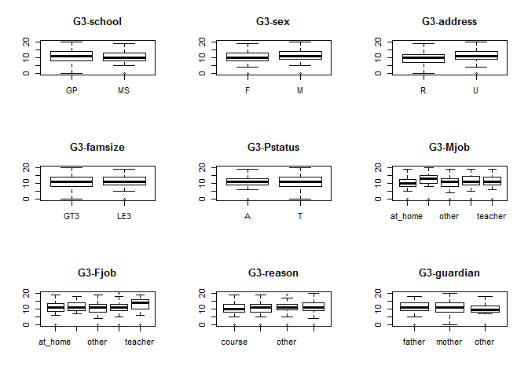

``` r
par(mfrow=c(2, 4))
plot(studentMat$schoolsup, studentMat$G3, main="G3-schoolsup")
plot(studentMat$famsup, studentMat$G3, main="G3-famsup")
plot(studentMat$paid, studentMat$G3, main="G3-paid")
plot(studentMat$activities, studentMat$G3, main="G3-activities")
plot(studentMat$nursery, studentMat$G3, main="G3-nursery")
plot(studentMat$higher, studentMat$G3, main="G3-higher")
plot(studentMat$internet, studentMat$G3, main="G3-internet")
plot(studentMat$romantic, studentMat$G3, main="G3-romantic")
```

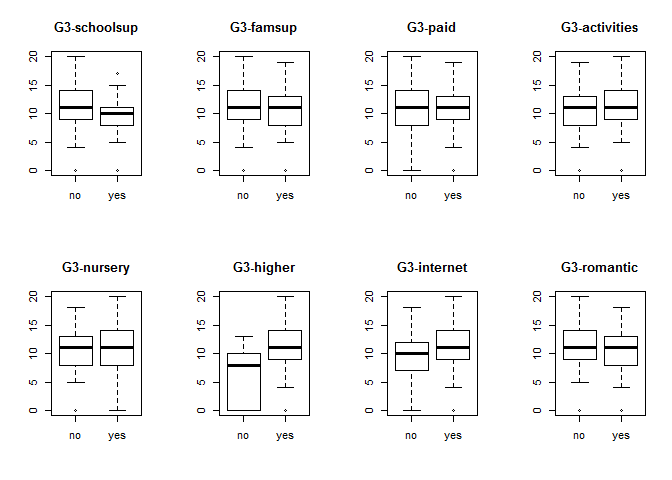

Observamos que de todas las variables de tipo factor solos las variables Mjob, Fjob, higher e internet paracen influir en la nota final G3 por lo que el resto parecen no ser buenas variables predictoras.

Creamos un data frame sin los atributos anteriores:

``` r
studentMat2 <- studentMat %>% select(-school, -sex, -address, -famsize, -Pstatus,
                                     -reason, - guardian, -schoolsup, -famsup, -paid, 
                                     -activities, -nursery, -romantic)
```

**Análisis de las variables numéricas:**
Creamos una variable dummy pass que sera 1 si G3&gt;9 y 0 en caso contrario

``` r
studentMat2$pass <- ifelse(studentMat2$G3>9, 1,0)  
```

Convertimos las varible higher de tipo factor a numérica:

``` r
studentMat2$Mjob <- as.numeric(studentMat2$Mjob)
studentMat2$Fjob <- as.numeric(studentMat2$Fjob)
studentMat2$higher <- as.numeric(studentMat2$higher)
studentMat2$internet <- as.numeric(studentMat2$internet) 
```

Creamos la matriz de correlación para los estudiantes de matemáticas:

``` r
plot.new()
library(corrplot)
matCorMat <- cor(studentMat2)
matCorMat[is.na(matCorMat)] <- 0
col <- colorRampPalette(c('#BB4444', '#EE9988', '#FFFFFF', '#77AADD', '#4477AA'))
corrplot(matCorMat, type = "lower", tl.srt = 15, tl.col = 'black')
```

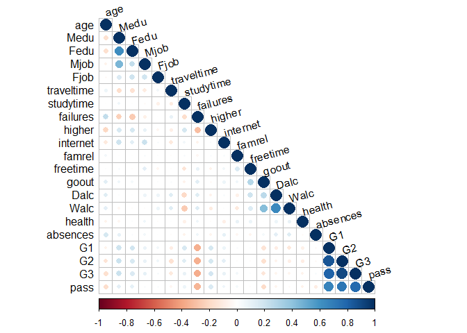

Observamos una alta correlación entre las notas del primer y segundo semestre (G1 y G2) con la nota final del curso (G3). También se observa una cierta alta correlación entre salir y beber alcohol los fines de semana y entre los niveles de educación del padre y la madre lo cual tiene sentido.

3. Análisis exploratorio apoyado de un método no supervisado: Clustering. K-Means
---------------------------------------------------------------------------------

Aplicación del método sobre el data drame studentMat2:

**Calculamos el número óptimo de clusters según Elbow:**

``` r
mydata <- studentMat2 
wss <- (nrow(mydata)-1)*sum(apply(mydata,2,var)) 
for (i in 2:15) wss[i] <- sum(kmeans(mydata, centers=i)$withinss)
plot(1:15, wss, type="b", xlab="Numero de Clusters", 
     ylab="Sumas de cuadrados dentro de los grupos", 
     main="Num de clusters óptimo según Elbow", pch=20, cex=2)
```

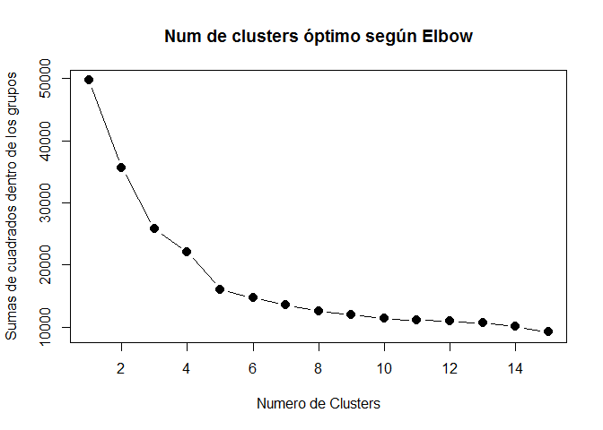

A partir de k=5 la variación de la suma de los cuadrados de dentro de los grupos es muy pequeña por lo que aplicaemos K-means para 5 clusters:

``` r
set.seed(1234) 
kmeansMat.clust <- kmeans(studentMat2, 5) 
kmeansMat.clust
```

    ## K-means clustering with 5 clusters of sizes 5, 127, 152, 39, 72
    ## 
    ## Cluster means:
    ##        age     Medu     Fedu     Mjob     Fjob traveltime studytime
    ## 1 17.80000 3.000000 3.000000 3.400000 3.600000   1.400000  2.000000
    ## 2 16.40945 3.015748 2.748031 3.251969 3.354331   1.338583  2.141732
    ## 3 16.58553 2.539474 2.394737 3.125000 3.269737   1.546053  2.039474
    ## 4 17.02564 2.282051 2.256410 2.923077 3.282051   1.589744  1.974359
    ## 5 17.18056 2.958333 2.500000 3.236111 3.152778   1.361111  1.875000
    ##     failures   higher internet   famrel freetime    goout     Dalc
    ## 1 0.40000000 1.800000 2.000000 4.200000 2.200000 2.600000 1.400000
    ## 2 0.05511811 1.984252 1.866142 4.031496 3.307087 2.937008 1.354331
    ## 3 0.31578947 1.947368 1.782895 4.000000 3.184211 3.131579 1.486842
    ## 4 0.94871795 1.846154 1.794872 3.820513 3.128205 3.230769 1.358974
    ## 5 0.52777778 1.958333 1.888889 3.722222 3.347222 3.333333 1.763889
    ##       Walc   health    absences        G1        G2         G3      pass
    ## 1 2.000000 3.600000 52.60000000 10.200000 10.000000  9.4000000 0.4000000
    ## 2 2.047244 3.496063  3.04724409 14.488189 14.582677 14.8346457 1.0000000
    ## 3 2.361842 3.611842  3.34868421  9.125000  9.480263  9.6118421 0.6315789
    ## 4 1.974359 3.641026  0.05128205  7.538462  4.692308  0.1282051 0.0000000
    ## 5 2.763889 3.486111 15.19444444 10.236111  9.805556  9.9583333 0.5555556
    ## 
    ## Clustering vector:
    ##   [1] 3 3 5 2 3 2 3 3 2 2 3 3 2 3 2 2 2 3 5 3 2 2 2 2 3 5 3 2 3 5 3 2 2 3 2
    ##  [36] 3 2 2 3 2 5 3 2 3 5 3 5 2 2 3 2 2 3 3 3 3 2 2 3 2 3 3 3 3 3 2 2 3 3 2
    ##  [71] 2 3 4 2 1 3 3 3 3 5 3 3 5 2 3 3 3 2 5 5 3 2 3 3 2 3 2 3 2 3 5 2 2 5 2
    ## [106] 5 3 2 3 2 2 3 3 2 3 2 2 2 5 2 2 2 2 5 3 2 3 3 4 2 4 4 5 5 4 4 4 4 2 2
    ## [141] 4 3 3 2 4 3 4 3 4 3 4 2 3 4 3 3 2 3 2 3 4 3 4 3 3 5 3 2 4 2 4 2 3 4 3
    ## [176] 3 2 3 5 3 5 2 2 1 5 5 3 2 3 3 5 3 5 3 2 2 2 3 5 3 2 3 3 5 3 5 3 5 3 3
    ## [211] 5 5 2 5 5 2 5 5 3 3 3 4 2 2 2 5 2 3 5 5 5 3 5 2 5 5 2 5 3 4 5 3 4 2 4
    ## [246] 2 2 5 3 2 3 3 3 3 3 3 2 5 2 4 5 3 2 3 4 2 3 3 5 4 5 2 3 2 3 3 1 5 5 3
    ## [281] 5 5 3 3 3 3 2 2 2 2 5 2 5 2 2 2 4 5 2 2 5 3 2 2 5 2 2 1 2 5 4 5 3 5 5
    ## [316] 1 4 3 3 3 5 5 3 2 2 3 2 3 3 2 3 2 4 4 4 5 5 4 2 3 3 4 2 4 3 2 2 3 2 5
    ## [351] 3 2 3 3 3 3 2 3 3 2 2 2 3 2 3 3 2 4 3 5 3 2 3 5 2 3 2 3 2 5 2 3 3 4 5
    ## [386] 3 3 4 3 4 5 2 3 3 3
    ## 
    ## Within cluster sum of squares by cluster:
    ## [1]  972.000 4377.575 4869.164 1276.923 4559.167
    ##  (between_SS / total_SS =  67.7 %)
    ## 
    ## Available components:
    ## 
    ## [1] "cluster"      "centers"      "totss"        "withinss"    
    ## [5] "tot.withinss" "betweenss"    "size"         "iter"        
    ## [9] "ifault"

``` r
kmeansMat.clust$size
```

    ## [1]   5 127 152  39  72

**Representación del cluster mayoritario (cluster 3):**

``` r
radial.plot(kmeansMat.clust$centers[3,], labels = names(kmeansMat.clust$centers[3,]), rp.type = "s", point.symbol = 15, point.col = "blue", mar = c(1,0.5,1,3), radial.lim = c(0,20))
```

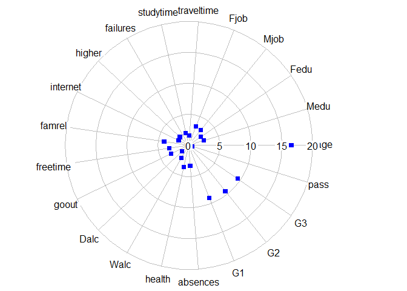

**Análisis del cluster mayoritario (cluster 3), perfil del alumno:**

``` r
studentMat_final<- studentMat %>% mutate(cluster_id = kmeansMat.clust$cluster)
studentMat_cluster3 <- subset(studentMat_final, studentMat_final$cluster_id == "3")
kable(head(studentMat_cluster3[,c(1:6,13:14,20:21,30,30:34)]))
```

|     | school | sex |  age| address | famsize | Pstatus |  traveltime|  studytime| nursery | higher |  absences|  absences.1|   G1|   G2|   G3|  cluster\_id|
|-----|:-------|:----|----:|:--------|:--------|:--------|-----------:|----------:|:--------|:-------|---------:|-----------:|----:|----:|----:|------------:|
| 1   | GP     | F   |   18| U       | GT3     | A       |           2|          2| yes     | yes    |         6|           6|    5|    6|    6|            3|
| 2   | GP     | F   |   17| U       | GT3     | T       |           1|          2| no      | yes    |         4|           4|    5|    5|    6|            3|
| 5   | GP     | F   |   16| U       | GT3     | T       |           1|          2| yes     | yes    |         4|           4|    6|   10|   10|            3|
| 7   | GP     | M   |   16| U       | LE3     | T       |           1|          2| yes     | yes    |         0|           0|   12|   12|   11|            3|
| 8   | GP     | F   |   17| U       | GT3     | A       |           2|          2| yes     | yes    |         6|           6|    6|    5|    6|            3|
| 11  | GP     | F   |   15| U       | GT3     | T       |           1|          2| yes     | yes    |         0|           0|   10|    8|    9|            3|

``` r
summary(studentMat_cluster3)
```

    ##  school   sex         age        address famsize   Pstatus      Medu      
    ##  GP:129   F:86   Min.   :15.00   R: 43   GT3:110   A: 14   Min.   :0.000  
    ##  MS: 23   M:66   1st Qu.:15.75   U:109   LE3: 42   T:138   1st Qu.:2.000  
    ##                  Median :17.00                             Median :2.000  
    ##                  Mean   :16.59                             Mean   :2.539  
    ##                  3rd Qu.:17.25                             3rd Qu.:4.000  
    ##                  Max.   :21.00                             Max.   :4.000  
    ##       Fedu             Mjob          Fjob           reason     guardian  
    ##  Min.   :0.000   at_home :26   at_home : 6   course    :70   father: 37  
    ##  1st Qu.:1.000   health  : 8   health  : 6   home      :40   mother:105  
    ##  Median :2.000   other   :62   other   :88   other     :12   other : 10  
    ##  Mean   :2.395   services:33   services:45   reputation:30               
    ##  3rd Qu.:3.000   teacher :23   teacher : 7                               
    ##  Max.   :4.000                                                           
    ##    traveltime      studytime        failures      schoolsup famsup  
    ##  Min.   :1.000   Min.   :1.000   Min.   :0.0000   no :118   no :57  
    ##  1st Qu.:1.000   1st Qu.:1.750   1st Qu.:0.0000   yes: 34   yes:95  
    ##  Median :1.000   Median :2.000   Median :0.0000                     
    ##  Mean   :1.546   Mean   :2.039   Mean   :0.3158                     
    ##  3rd Qu.:2.000   3rd Qu.:2.000   3rd Qu.:0.0000                     
    ##  Max.   :4.000   Max.   :4.000   Max.   :3.0000                     
    ##   paid    activities nursery   higher    internet  romantic      famrel 
    ##  no :76   no :79     no : 34   no :  8   no : 33   no :111   Min.   :1  
    ##  yes:76   yes:73     yes:118   yes:144   yes:119   yes: 41   1st Qu.:4  
    ##                                                              Median :4  
    ##                                                              Mean   :4  
    ##                                                              3rd Qu.:5  
    ##                                                              Max.   :5  
    ##     freetime         goout            Dalc            Walc      
    ##  Min.   :1.000   Min.   :1.000   Min.   :1.000   Min.   :1.000  
    ##  1st Qu.:3.000   1st Qu.:2.000   1st Qu.:1.000   1st Qu.:1.000  
    ##  Median :3.000   Median :3.000   Median :1.000   Median :2.000  
    ##  Mean   :3.184   Mean   :3.132   Mean   :1.487   Mean   :2.362  
    ##  3rd Qu.:4.000   3rd Qu.:4.000   3rd Qu.:2.000   3rd Qu.:3.000  
    ##  Max.   :5.000   Max.   :5.000   Max.   :5.000   Max.   :5.000  
    ##      health         absences           G1               G2       
    ##  Min.   :1.000   Min.   :0.000   Min.   : 3.000   Min.   : 5.00  
    ##  1st Qu.:3.000   1st Qu.:2.000   1st Qu.: 8.000   1st Qu.: 8.00  
    ##  Median :4.000   Median :3.500   Median : 9.000   Median :10.00  
    ##  Mean   :3.612   Mean   :3.349   Mean   : 9.125   Mean   : 9.48  
    ##  3rd Qu.:5.000   3rd Qu.:6.000   3rd Qu.:10.250   3rd Qu.:11.00  
    ##  Max.   :5.000   Max.   :9.000   Max.   :13.000   Max.   :13.00  
    ##        G3           cluster_id
    ##  Min.   : 5.000   Min.   :3   
    ##  1st Qu.: 8.750   1st Qu.:3   
    ##  Median :10.000   Median :3   
    ##  Mean   : 9.612   Mean   :3   
    ##  3rd Qu.:11.000   3rd Qu.:3   
    ##  Max.   :13.000   Max.   :3

Perfil del alumno en el cluster 3: la edad media es 17 años, pertenecen a familias numerosas que mantienen una buena relación familiar, con padres conviviendo juntos en la que la madre suele estar al cargo de ellos en casa. El nivel de educación de los padres es similar y sin estudios superiores. La gran mayoria van al colegio Gabriel Pereira y la razón principal fue "course". Residen en un entorno urbano cerca del colegio, afirman estudiar entre 2 y 5 horas semanales, no reciben apoyo educativo extra en el colegio pero si por parte familiar. Hay un igual numero de alumnos que paga por clases particulares como los que no pagan. La moyoria asistió a guarderia, tienen internet en casa, estan solteros y quieren cursar estudios superiores. Disponen de bastante tiempo libre despúes del colegio, salen bastante con los amigos, no suelen beber alcohol entre semana pero si algo los fin de semana, suelen faltar poco a clase, gozan de buena salud y suelen ir mejorando levemente las notas en cada semestre obteniendo una calificacion de aprobado por la mínima..

4. Modelos Supervisados: Modelos KNN y SVM
------------------------------------------

Se realizará la predicción de la calificacion final del alumno (aprobado o suspenso) en función de todos los atributos contenidos en el data frame studentMat2.

Convertimos la variable pass a tipo factor "pass" si "G3&gt;9 y "fail" en caso contrario

``` r
studentMat2$pass <- ifelse(studentMat$G3>9, "pass", "fail")
studentMat2$pass <- as.factor(studentMat2$pass)
prop.table(table(studentMat2$pass))
```

    ## 
    ##      fail      pass 
    ## 0.3291139 0.6708861

``` r
str(studentMat2)
```

    ## 'data.frame':    395 obs. of  21 variables:
    ##  $ age       : int  18 17 15 15 16 16 16 17 15 15 ...
    ##  $ Medu      : int  4 1 1 4 3 4 2 4 3 3 ...
    ##  $ Fedu      : int  4 1 1 2 3 3 2 4 2 4 ...
    ##  $ Mjob      : num  1 1 1 2 3 4 3 3 4 3 ...
    ##  $ Fjob      : num  5 3 3 4 3 3 3 5 3 3 ...
    ##  $ traveltime: int  2 1 1 1 1 1 1 2 1 1 ...
    ##  $ studytime : int  2 2 2 3 2 2 2 2 2 2 ...
    ##  $ failures  : int  0 0 3 0 0 0 0 0 0 0 ...
    ##  $ higher    : num  2 2 2 2 2 2 2 2 2 2 ...
    ##  $ internet  : num  1 2 2 2 1 2 2 1 2 2 ...
    ##  $ famrel    : int  4 5 4 3 4 5 4 4 4 5 ...
    ##  $ freetime  : int  3 3 3 2 3 4 4 1 2 5 ...
    ##  $ goout     : int  4 3 2 2 2 2 4 4 2 1 ...
    ##  $ Dalc      : int  1 1 2 1 1 1 1 1 1 1 ...
    ##  $ Walc      : int  1 1 3 1 2 2 1 1 1 1 ...
    ##  $ health    : int  3 3 3 5 5 5 3 1 1 5 ...
    ##  $ absences  : int  6 4 10 2 4 10 0 6 0 0 ...
    ##  $ G1        : int  5 5 7 15 6 15 12 6 16 14 ...
    ##  $ G2        : int  6 5 8 14 10 15 12 5 18 15 ...
    ##  $ G3        : int  6 6 10 15 10 15 11 6 19 15 ...
    ##  $ pass      : Factor w/ 2 levels "fail","pass": 1 1 2 2 2 2 2 1 2 2 ...

Creamos los dataset de entrenamiento y test:

``` r
index.studentMat2 <- createDataPartition(studentMat2$pass, p=0.8, list=F)
train.studentMat2 <- studentMat2[index.studentMat2,] 
test.studentMat2 <- studentMat2[ -index.studentMat2, ]
```

Comprobamos que las proporciones de aprobados y suspensos se mantienen en los nuevos datasets:

``` r
prop.table( table(train.studentMat2$pass))
```

    ## 
    ##      fail      pass 
    ## 0.3291139 0.6708861

``` r
prop.table( table(test.studentMat2$pass))
```

    ## 
    ##      fail      pass 
    ## 0.3291139 0.6708861

**Preprocesado de datos**
Busqueda de variables con varianza casi nula que no aportan nada al calsificador:

``` r
zero.var.train.studentMat2 <- nearZeroVar( train.studentMat2[,-dim(train.studentMat2)[2]], saveMetrics=F )
colnames(train.studentMat2)[zero.var.train.studentMat2]
```

    ## character(0)

No tenemos variables con varianza casi nula.

Busqueda de variables fuertemente correladas:

``` r
cor.train.studentMat2.matrix <- cor( train.studentMat2[, -dim(train.studentMat2)[2]] )
cor.train.studentMat2.index <- findCorrelation( cor.train.studentMat2.matrix, 0.75 ) 
cor.train.studentMat2.index
```

    ## [1] 19 20

``` r
cor.train.studentMat2 <- train.studentMat2[,-cor.train.studentMat2.index] 
dim(cor.train.studentMat2)
```

    ## [1] 316  19

``` r
cor.test.studentMat2 <- test.studentMat2[,-cor.train.studentMat2.index] 
dim(cor.test.studentMat2)
```

    ## [1] 79 19

Se ha reducido en número de variables predictoras en 2 (de 21 a 19) quitando las que estan correladas.

Centramos y escalamos las variables para reducir la desviación:

``` r
xTrans.studentMat2 <- preProcess(cor.train.studentMat2[, -dim(cor.train.studentMat2)[2]]) 
train.studentMat2.prep <- predict( xTrans.studentMat2, cor.train.studentMat2[,-dim(cor.train.studentMat2)[2]]) 
train.studentMat2.prep$pass <- cor.train.studentMat2$pass
test.studentMat2.prep <- predict( xTrans.studentMat2, cor.test.studentMat2[,-dim(cor.test.studentMat2)[2]]) 
test.studentMat2.prep$pass <- cor.test.studentMat2$pass
```

### 4.1 Generación de modelos

### 4.1.1 Modelo KNN

**Entrenamos el modelo**

``` r
knn.control <- trainControl(method="repeatedcv", repeats=5)
knn.studentMat2.model <- train(x=train.studentMat2.prep[,-dim(train.studentMat2.prep)[2]], y=train.studentMat2.prep$pass, method="knn", tuneLength=10, trControl=knn.control)
knn.studentMat2.model
```

    ## k-Nearest Neighbors 
    ## 
    ## 316 samples
    ##  18 predictor
    ##   2 classes: 'fail', 'pass' 
    ## 
    ## No pre-processing
    ## Resampling: Cross-Validated (10 fold, repeated 5 times) 
    ## Summary of sample sizes: 285, 284, 285, 285, 283, 285, ... 
    ## Resampling results across tuning parameters:
    ## 
    ##   k   Accuracy   Kappa    
    ##    5  0.7393280  0.3432740
    ##    7  0.7495131  0.3584835
    ##    9  0.7502719  0.3494646
    ##   11  0.7495876  0.3431289
    ##   13  0.7468066  0.3330989
    ##   15  0.7348259  0.2877071
    ##   17  0.7255040  0.2513640
    ##   19  0.7236315  0.2415871
    ##   21  0.7234714  0.2398178
    ##   23  0.7279283  0.2447421
    ## 
    ## Accuracy was used to select the optimal model using  the largest value.
    ## The final value used for the model was k = 9.

``` r
plot1 <- plot(knn.studentMat2.model, metric="Accuracy") 
print(plot1)
```

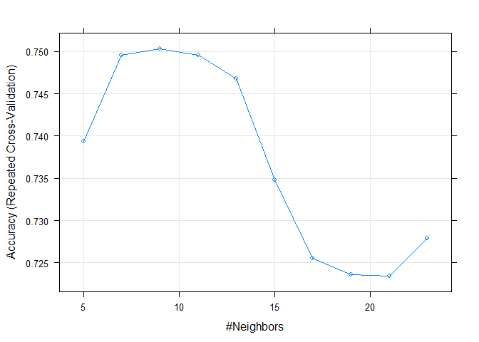

**Predicción KNN sobre el conjunto de test**

``` r
knn.studentMat2.test <- predict(knn.studentMat2.model, newdata= test.studentMat2.prep[,-dim(train.studentMat2.prep)[2]]) 
knn.studentMat2.test
```

    ##  [1] fail pass pass pass pass pass pass pass pass pass fail pass pass pass
    ## [15] pass pass pass pass pass pass pass fail pass pass pass pass fail pass
    ## [29] pass pass pass pass pass pass pass pass fail fail fail pass pass pass
    ## [43] pass pass pass fail pass pass pass fail pass pass pass pass pass pass
    ## [57] pass pass pass pass pass pass pass pass pass pass pass pass fail pass
    ## [71] pass pass pass fail pass pass fail pass fail
    ## Levels: fail pass

**Extracción de prediciones**

``` r
knn.studentMat2.test.preds <- extractPrediction( list(model1=knn.studentMat2.model), testX=test.studentMat2.prep[,-dim(train.studentMat2.prep)[2]] , testY=test.studentMat2.prep$pass)
conjunto.test.preds <- subset(knn.studentMat2.test.preds, dataType== "Test") 
head(conjunto.test.preds)
```

    ##      obs pred model dataType object
    ## 317 fail fail   knn     Test model1
    ## 318 pass pass   knn     Test model1
    ## 319 pass pass   knn     Test model1
    ## 320 pass pass   knn     Test model1
    ## 321 pass pass   knn     Test model1
    ## 322 pass pass   knn     Test model1

**Extraccion de probabilidades**

``` r
knn.studentMat2.test.probs <- extractProb( list(model1=knn.studentMat2.model), testX= test.studentMat2.prep[,-dim(train.studentMat2.prep)[2]], testY=test.studentMat2.prep$pass) 
conjunto.test.probs <- subset(knn.studentMat2.test.probs, dataType== "Test") 
plotClassProbs(conjunto.test.probs )
```

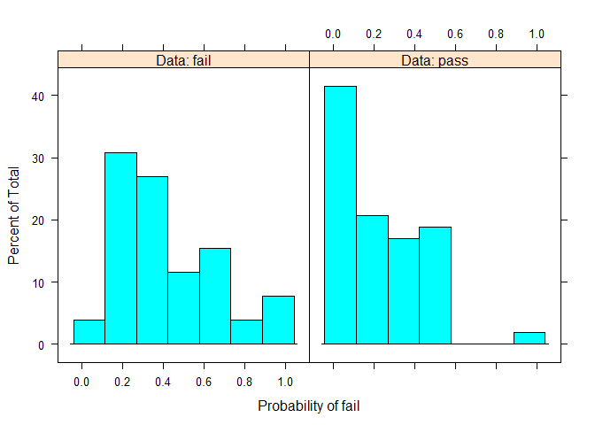

**Evaluación del modelo, matriz de confusión y curvas ROC**

``` r
confusionMatrix(knn.studentMat2.test, test.studentMat2.prep$pass)
```

    ## Confusion Matrix and Statistics
    ## 
    ##           Reference
    ## Prediction fail pass
    ##       fail    9    4
    ##       pass   17   49
    ##                                           
    ##                Accuracy : 0.7342          
    ##                  95% CI : (0.6228, 0.8273)
    ##     No Information Rate : 0.6709          
    ##     P-Value [Acc > NIR] : 0.140028        
    ##                                           
    ##                   Kappa : 0.3102          
    ##  Mcnemar's Test P-Value : 0.008829        
    ##                                           
    ##             Sensitivity : 0.3462          
    ##             Specificity : 0.9245          
    ##          Pos Pred Value : 0.6923          
    ##          Neg Pred Value : 0.7424          
    ##              Prevalence : 0.3291          
    ##          Detection Rate : 0.1139          
    ##    Detection Prevalence : 0.1646          
    ##       Balanced Accuracy : 0.6353          
    ##                                           
    ##        'Positive' Class : fail            
    ## 

``` r
pr <- prediction(ifelse(knn.studentMat2.test == 'pass',1,0), ifelse(test.studentMat2.prep$pass == 'pass',1,0)) 
prf <- performance(pr, measure = "tpr", x.measure = "fpr") 
plot(prf)
```

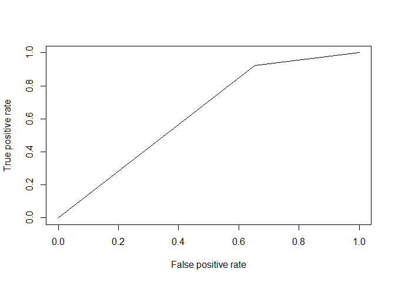

### 4.1.2 Modelo SVM

**Entrenamos el modelo**

``` r
svm.control <- trainControl(method="repeatedcv", repeats=5) 
svm.studentMat2.model <- train(x=train.studentMat2.prep[,-dim(train.studentMat2.prep)[2]], y=train.studentMat2.prep$pass, method="svmRadial", tuneLength=10, trControl=svm.control)
```

    ## 
    ## Attaching package: 'kernlab'

    ## The following object is masked from 'package:ggplot2':
    ## 
    ##     alpha

``` r
svm.studentMat2.model
```

    ## Support Vector Machines with Radial Basis Function Kernel 
    ## 
    ## 316 samples
    ##  18 predictor
    ##   2 classes: 'fail', 'pass' 
    ## 
    ## No pre-processing
    ## Resampling: Cross-Validated (10 fold, repeated 5 times) 
    ## Summary of sample sizes: 285, 284, 285, 284, 284, 284, ... 
    ## Resampling results across tuning parameters:
    ## 
    ##   C       Accuracy   Kappa       
    ##     0.25  0.6710013   0.000000000
    ##     0.50  0.6710013   0.000000000
    ##     1.00  0.6710013   0.000000000
    ##     2.00  0.6678550  -0.006099622
    ##     4.00  0.6678550  -0.006099622
    ##     8.00  0.6678550  -0.006099622
    ##    16.00  0.6678550  -0.006099622
    ##    32.00  0.6678550  -0.006099622
    ##    64.00  0.6678550  -0.006099622
    ##   128.00  0.6678550  -0.006099622
    ## 
    ## Tuning parameter 'sigma' was held constant at a value of 0.03755525
    ## Accuracy was used to select the optimal model using  the largest value.
    ## The final values used for the model were sigma = 0.03755525 and C = 0.25.

``` r
plot1 <- plot(svm.studentMat2.model, metric="Accuracy") 
print(plot1)
```

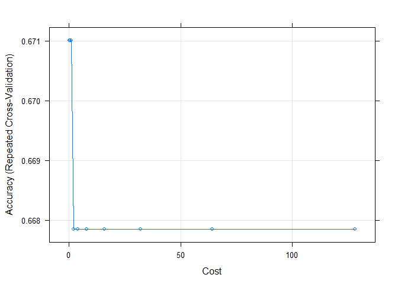

**Predicción SVM sobre el conjunto de test**

``` r
svm.studentMat2.test <- predict(svm.studentMat2.model, newdata= test.studentMat2.prep[,-dim(train.studentMat2.prep)[2]]) 
svm.studentMat2.test
```

    ##  [1] pass pass pass pass pass pass pass pass pass pass pass pass pass pass
    ## [15] pass pass pass pass pass pass pass pass pass pass pass pass pass pass
    ## [29] pass pass pass pass pass pass pass pass pass pass pass pass pass pass
    ## [43] pass pass pass pass pass pass pass pass pass pass pass pass pass pass
    ## [57] pass pass pass pass pass pass pass pass pass pass pass pass pass pass
    ## [71] pass pass pass pass pass pass pass pass pass
    ## Levels: fail pass

**Evaluación del modelo, matriz de confusión y curvas ROC**

``` r
confusionMatrix(svm.studentMat2.test, test.studentMat2.prep$pass)
```

    ## Confusion Matrix and Statistics
    ## 
    ##           Reference
    ## Prediction fail pass
    ##       fail    0    0
    ##       pass   26   53
    ##                                          
    ##                Accuracy : 0.6709         
    ##                  95% CI : (0.556, 0.7725)
    ##     No Information Rate : 0.6709         
    ##     P-Value [Acc > NIR] : 0.5529         
    ##                                          
    ##                   Kappa : 0              
    ##  Mcnemar's Test P-Value : 9.443e-07      
    ##                                          
    ##             Sensitivity : 0.0000         
    ##             Specificity : 1.0000         
    ##          Pos Pred Value :    NaN         
    ##          Neg Pred Value : 0.6709         
    ##              Prevalence : 0.3291         
    ##          Detection Rate : 0.0000         
    ##    Detection Prevalence : 0.0000         
    ##       Balanced Accuracy : 0.5000         
    ##                                          
    ##        'Positive' Class : fail           
    ## 

``` r
pr <- prediction(ifelse(svm.studentMat2.test == 'pass',1,0), ifelse(test.studentMat2.prep$pass == 'pass',1,0))
prf <- performance(pr, measure = "tpr", x.measure = "fpr") 
plot(prf)
```

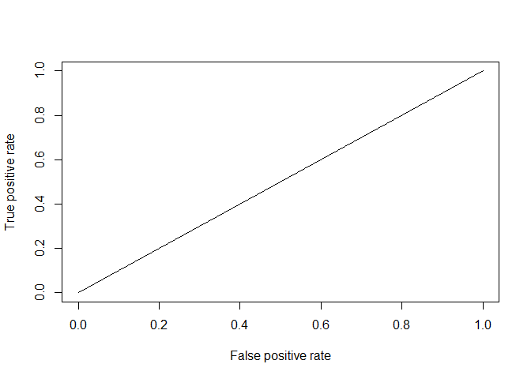

Obtenemos una gráfica que representa un clasificador aleatorio con la misma proporción de aciertos que de fallos. Esto puede ser debido a una mala selección de las variables predictoras para el modelo.

### Comparación de Modelos: KNN vs SVM

**Model1=knn, Model2=SVM**

``` r
models <- list( knn.studentMat2.model, svm.studentMat2.model ) 
compar.models <- resamples( models ) 
summary( compar.models )
```

    ## 
    ## Call:
    ## summary.resamples(object = compar.models)
    ## 
    ## Models: Model1, Model2 
    ## Number of resamples: 50 
    ## 
    ## Accuracy 
    ##           Min. 1st Qu.    Median      Mean   3rd Qu.      Max. NA's
    ## Model1 0.65625 0.71875 0.7419355 0.7502719 0.7741935 0.9032258    0
    ## Model2 0.65625 0.65625 0.6774194 0.6710013 0.6774194 0.6875000    0
    ## 
    ## Kappa 
    ##        Min.  1st Qu.    Median      Mean   3rd Qu.      Max. NA's
    ## Model1    0 0.244832 0.3043316 0.3494646 0.4534481 0.7596899    0
    ## Model2    0 0.000000 0.0000000 0.0000000 0.0000000 0.0000000    0

``` r
dotplot( compar.models)
```

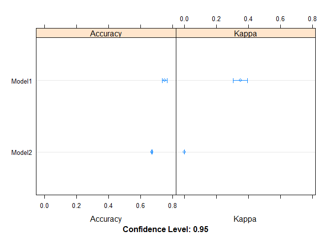

En este caso el Modelo 1= KNN tiene mayor precisión en la predicción.
